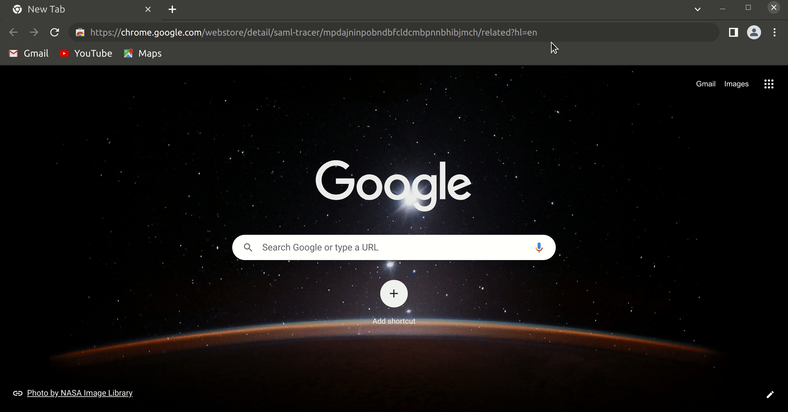
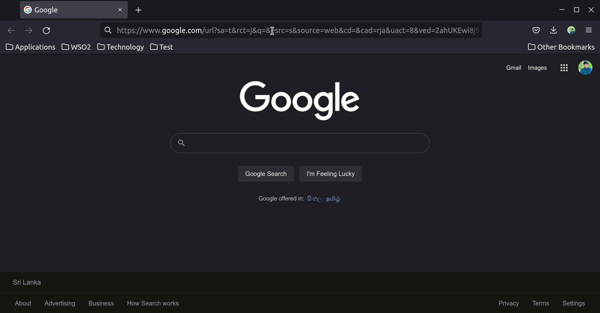
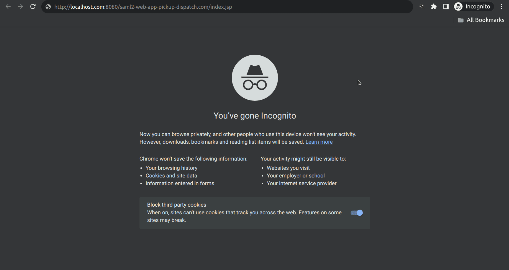

# SAML Trace Capture

This contains the instructions to record and capture a SAML trace through the browser.

## Installing the Extension

### Chromium Browsers (incl. Chrome and Edge)

1. Locate the extension that is available at
   the [Chrome web store](https://chrome.google.com/webstore/detail/saml-tracer/mpdajninpobndbfcldcmbpnnbhibjmch?hl=en).
2. Install the extension.
3. Allow the extension to be executed in incognito windows.

### Firefox Browser

1. Locate the add-on that is available at
   the [Firefox add-on store](https://addons.mozilla.org/en-US/firefox/addon/saml-tracer/).
2. Install the extension.
3. Allow the extension to be executed in private windows.

## Capturing the SAML trace (Common for the browsers)

1. Locate the extension/add-on on the top toolbar and click it.
2. Recreate the issue while the extension/add-on is executing in the background.
3. Export the captured trace by clicking on the export button and save it in a convenient location.
